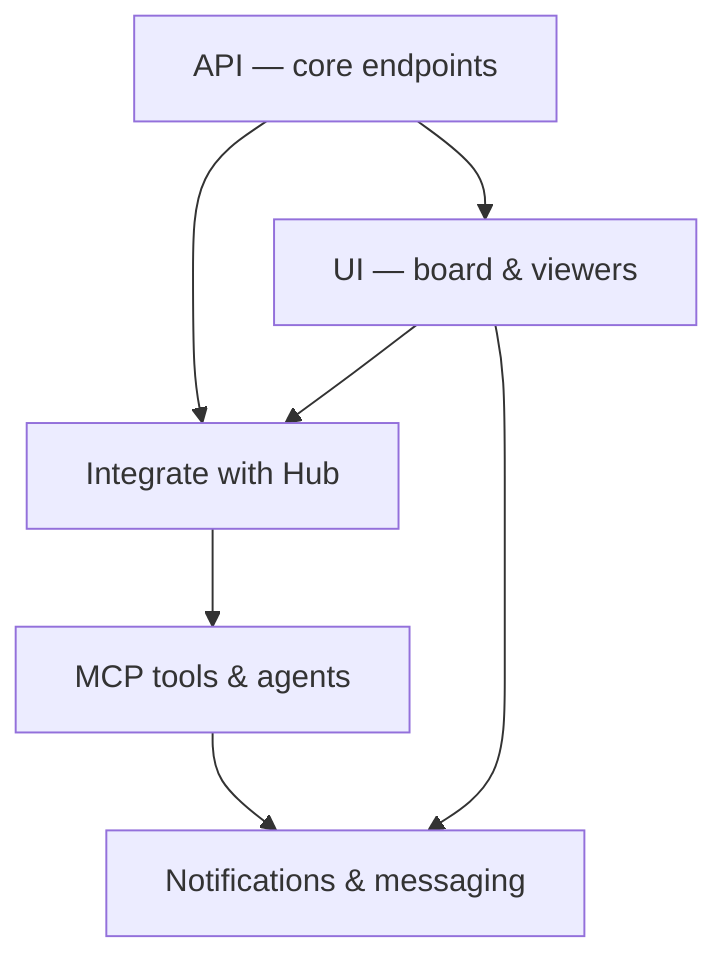
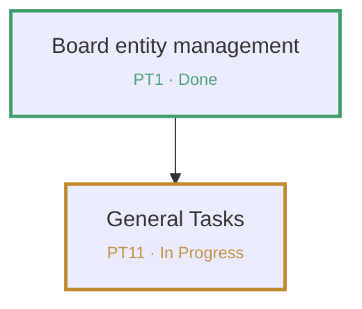

# Mermaid Diagrams (Oriel)

A diagram should **make an argument**, not just decorate. Before drawing, know the one thing
the picture must convey (a job flow, a dependency, a sequence of calls) — then pick the
diagram type that carries that meaning, and keep it small enough to read at a glance.

Anyone can adopt this skill (it is not role-specific). The Designer typically uses it right
after the **design-interview** to give the user a one-picture, high-level overview to sign off.

## When to use
- A project needs a **high-level job-flow overview** — e.g. *API → UI → integrate with Hub →
  add MCP → …* — for the user to verify before work is decomposed.
- You're explaining an architecture, a request sequence, a state machine, or a data model and
  prose alone is hard to follow.

## Pick the diagram type
| You want to show… | Use |
| --- | --- |
| Steps / job flow / dependencies | `flowchart TD` (top-down) or `LR` (left-right) |
| Messages between actors/services over time | `sequenceDiagram` |
| States and transitions (lifecycle, retries) | `stateDiagram-v2` |
| Entities and relationships (data model) | `erDiagram` |
| Nested breakdown of one idea | `mindmap` |

Default to a **flowchart** for project overviews. One diagram = one idea; split rather than
cram. Avoid Gantt/pie/timeline for design overviews — they rarely carry an argument.

## Syntax rules that prevent broken charts
- Start with `flowchart TD` (modern), **not** `graph TD` (legacy).
- Give nodes meaningful ids and quote any label with spaces or punctuation:
  `A["API — core endpoints"] --> B["UI — board & viewers"]`.
- Quote labels containing `()`, `:`, `,`, `#`, or `&`. Never use the bare reserved word
  `end` as a node id — quote it or rename.
- Keep edges directional and labeled when the relationship isn't obvious:
  `A -->|emits| B`.
- Prefer ≤ ~12 nodes. If it's bigger, it's probably two diagrams.

Minimal example (a project job flow):

## Board loop — author, store, verify
1. Draft the Mermaid source per the rules above. Keep it to the **epic-level** big picture for
   a project overview (don't enumerate every task).
2. Store it on the project: `set_project_flowchart(project_id, mermaid)`. Passing an empty
   string clears it. Read the current chart back from `list_projects` (the `flowchart` field).
3. Ask the user to **verify**: they open the project's **Flow** button on the board, see the
   rendered chart, and confirm or request changes. Ask one focused question if anything is
   ambiguous (don't batch).
4. Record the outcome on the relevant story: `add_comment("DECISION: high-level flow approved
   — <one line>")`. Iterate by calling `set_project_flowchart` again until approved.

## The project epic-flow chart (the board's plan map)
This is the canonical chart a project's **Flow** button shows: **one node per epic**, so every
element points to a real board epic and the picture doubles as the plan. Build/refresh it like this:

1. List the project's epics: `list_entities(project_id, …)`, keep `type == "epic"`. Take each
   epic's `key`, `title`, `status`.
2. **One node per epic.** Node id = the epic key. Label = the title on line 1, then a **smaller
   second line** `KEY · Status`, colored by status — the viewer renders HTML labels:
   `PT11["General Tasks PT11 · In Progress"]`
   Escape `&` as `&amp;` inside labels.
3. Color the node **border** by status via a `classDef` (accent, not flood — matches the board's
   restrained look) and assign each node its class.
4. Draw edges for how the epics **relate / sequence** (build order or dependencies). Keep it a DAG.
5. Store it: `set_project_flowchart(project_id, mermaid)`.

**Status → color** (the board's own `--status-*` palette):

| status | label | hex |
| --- | --- | --- |
| `backlog` | Backlog | `#8a8f98` |
| `ready` | Ready | `#3f7fd1` |
| `in_progress` | In Progress | `#c0892d` |
| `blocked` | Blocked | `#c0473b` |
| `in_review` | In Review | `#8a6fc0` |
| `done` | Done | `#3f9d6b` |
| `cancelled` | Cancelled | `#b8b8b8` (use `stroke-dasharray:4 3`) |

Template:

**Keep it current.** Whenever you **change an epic's status** (`set_status` on an epic), or add /
remove / rename an epic, regenerate this chart and call `set_project_flowchart` again so the node
colors match the board. This is a startup-protocol rule — see `get_skill('startup-protocol')`.

## Rules
- The board UI renders Mermaid **client-side** and themes it grayscale. The **one sanctioned use
  of color is status** — and only via the `--status-*` palette above (node border + the second
  label line). Do NOT add any other/decorative color, and do NOT flood-fill nodes (`classDef
  fill:#…`); convey everything else through structure, direction, grouping (`subgraph`), and labels.
- Validate by viewing: if the Flow viewer shows a render error, fix the syntax (usually an
  unquoted label or a bare `end`) and store again.
- Design first, then decompose. The chart is for agreeing on the shape — not a substitute for
  acceptance criteria or tasks.
